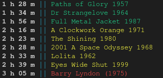

# film-list
Recursively lists the video files in a directory and sorts them by run time.

Simply run the script with an argument containing the video directory.

e.g. `__init__.py ~/Movies/Horror`

# Examples

A collection of films organised by duration

